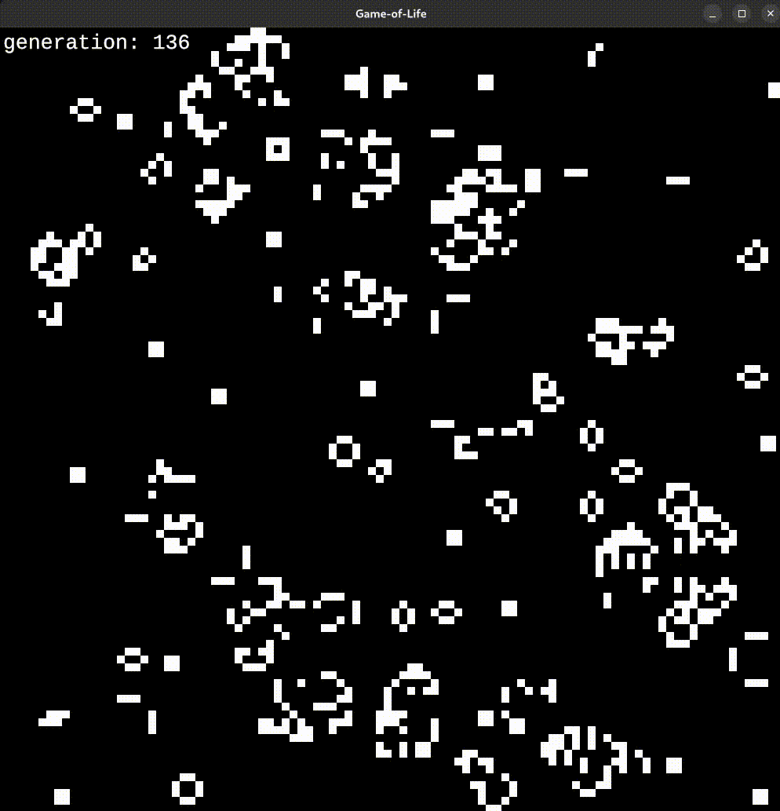

# 🎮 GoL-rs
A Game of Life implementation in rust.
 

## Features
- Random generation of live cells.

## Keybindings
- Press 'Space' to pause/play the game.
- Press 'C' to clear and restart the game.
- Press 'Esc' to quit the game.

## Installation
Coming soon to Cargo crates.

## Todo
- [ ] Use [clap](https://github.com/clap-rs/clap) to parse arguments from the command line.
- [ ] Build a gui interface for the game using [egui](https://github.com/emilk/egui).

## Credits
- [ggez](https://github.com/ggez/ggez), a rust library to create games easily.
